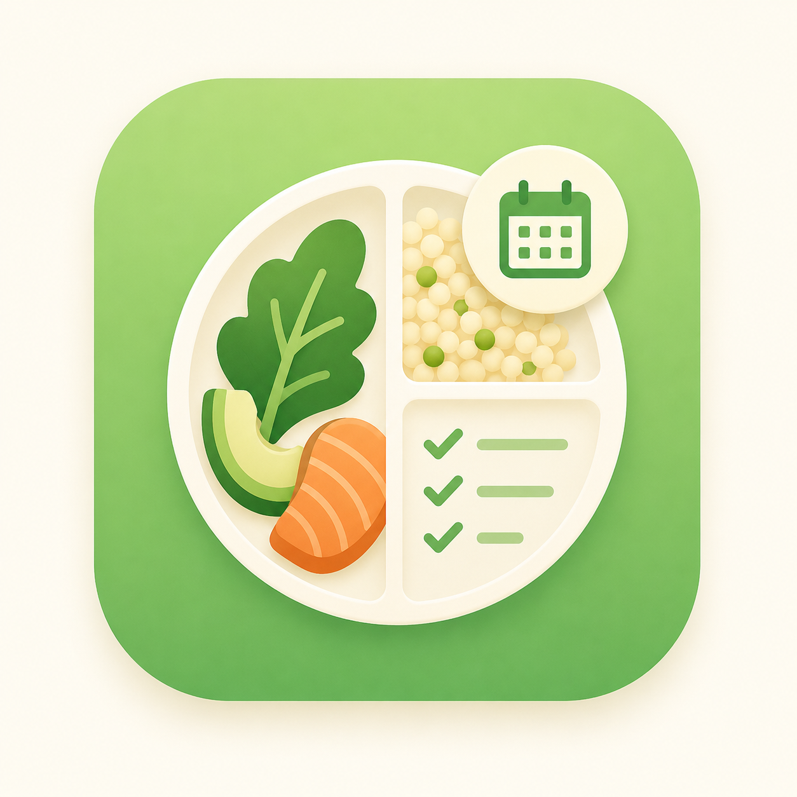
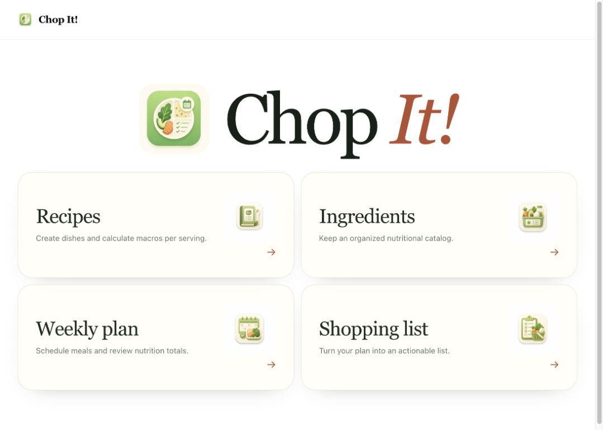
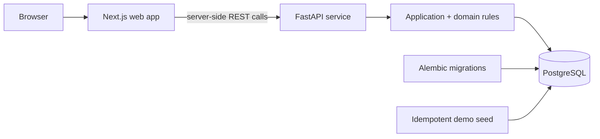

<div align="center">
  
  <h1>Chop It!</h1>
  <p><strong>From recipe ideas to a nutrition-aware shopping list.</strong></p>
  <p>
    A polished, full-stack meal-planning demo that turns ingredients and recipes into
    weekly plans, macro totals, and actionable shopping lists.
  </p>
  <p>
    
    
    
    
    
  </p>
</div>



## Why this project exists

Chop It demonstrates how I approach product engineering: start with a real workflow, model its
rules explicitly, and deliver the complete vertical slice—from interface and API contracts to
persistence, automated tests, migrations, and a one-command runtime.

The result is intentionally easy to evaluate. Clone it, start Docker Compose, and explore a seeded
dataset without creating an account or configuring third-party services.

> [!IMPORTANT]
> **Portfolio Lite edition.** This repository contains the standalone, public-safe version of a
> larger module originally built inside the private **LifeHub** project. It intentionally starts
> with a clean Git history: only the extracted product, fictional demo data, and the infrastructure
> required to run it are included. LifeHub authentication, user switching, orchestration, and
> unrelated modules are outside this edition.

## Start in one command

You only need Docker with Docker Compose.

```bash
git clone https://github.com/EAlmazanG/chop-it.git
cd chop-it
cp .env.example .env
docker compose up --build
```

Once the containers are healthy, open:

| Service | URL | Purpose |
| --- | --- | --- |
| Web app | <http://localhost:3000/chop-it> | Explore the complete product flow |
| API docs | <http://localhost:8000/docs> | Inspect and try the REST API |
| Health check | <http://localhost:8000/api/v1/health> | Confirm API availability |

The first startup applies the Alembic migrations and loads an idempotent fictional dataset. Data is
kept in a named PostgreSQL volume, so stopping the stack does not erase your changes.

```bash
make down        # stop the stack and preserve data
make reset-demo  # recreate the database from the demo seed
```

## Product tour

### 1. Build a nutrition-aware ingredient catalog

Create and organize ingredients, define their unit and macros per 100 g/ml, classify them by their
primary macro, and add reusable secondary tags.


### 2. Compose recipes with calculated macros

Combine catalog ingredients, quantities, servings, and oil usage. The backend calculates total and
per-serving energy, protein, fat, and carbs from the stored nutrition data.


### 3. Plan the week

Assign recipes to meal slots, navigate between weeks, and review daily totals, weekly totals, and
daily averages without maintaining a separate spreadsheet.


### 4. Turn the plan into a shopping list

Choose the days to shop for, exclude meals, subtract pantry quantities, consolidate duplicate
ingredients, mark purchases, export the result, and archive completed lists.


For a step-by-step walkthrough, see the [product tour](docs/product-tour.md).

## How it works



The browser talks to the Next.js application. Server components and server actions call FastAPI
through the internal Compose network, keeping business rules behind a clear API boundary. FastAPI
coordinates domain calculations and SQLAlchemy repositories; PostgreSQL stores the catalog, plans,
and generated lists.

### Technology choices

| Layer | Stack | What it provides |
| --- | --- | --- |
| Web | Next.js 15, React 19, TypeScript, Tailwind CSS | Server-rendered flows, server actions, responsive UI |
| API | FastAPI, Pydantic, SQLAlchemy | Typed contracts, validation, application services, persistence |
| Data | PostgreSQL 16, Alembic | Relational integrity, durable state, versioned migrations |
| Delivery | Docker Compose, multi-stage images | Reproducible local runtime and service health ordering |
| Quality | pytest, Jest, Ruff, ESLint, mypy, TypeScript | Automated behavior, style, and type checks |

The backend follows a small layered structure—API, application, domain, and infrastructure—without
adding abstractions that the product does not need. Nutrition calculations are pure domain
functions, while shopping-list generation is coordinated in the application and repository layers.

Read the [architecture notes](docs/architecture.md) for the request lifecycle, data model, startup
sequence, and main engineering decisions.

## Repository map

```text
.
├── apps/
│   ├── api/                  # FastAPI, domain logic, SQLAlchemy, Alembic, pytest
│   └── web/                  # Next.js, React, Tailwind CSS, Jest
├── docs/
│   ├── images/               # Screenshots used by this presentation
│   ├── architecture.md       # Technical design and runtime behavior
│   └── product-tour.md       # End-to-end usage guide
├── infra/docker/             # Production-oriented multi-stage Dockerfiles
├── compose.yaml              # Database, migration, API, and web orchestration
├── Makefile                  # Short, repeatable project commands
└── SECURITY.md               # Supported-use and deployment boundaries
```

## Development and quality checks

The Docker workflow is the recommended way to evaluate the project. For local development without
rebuilding images, install Python 3.12, `uv`, Node.js 22, and pnpm 11, then use `.env.example` as the
configuration reference for each application.

```bash
make compose-check  # validate the Compose model
make lint           # Ruff + ESLint
make typecheck      # mypy + TypeScript
make test           # pytest + Jest
```

The GitHub Actions workflow runs the same lint, type, test, build, and Compose validation steps on
pushes and pull requests.

## Demo and security boundaries

- The app uses one fixed local demo profile; there is no authentication or user switching.
- Included meals, quantities, and nutrition values are fictional and are not dietary advice.
- Default credentials are development-only values for the local Compose network.
- Do not expose this Lite edition to untrusted networks without authentication, authorization,
  secret management, HTTPS, rate limiting, backups, and a deployment-specific threat model.

See [SECURITY.md](SECURITY.md) for the supported-use statement and reporting instructions.

## License

Released under the [MIT License](LICENSE).
