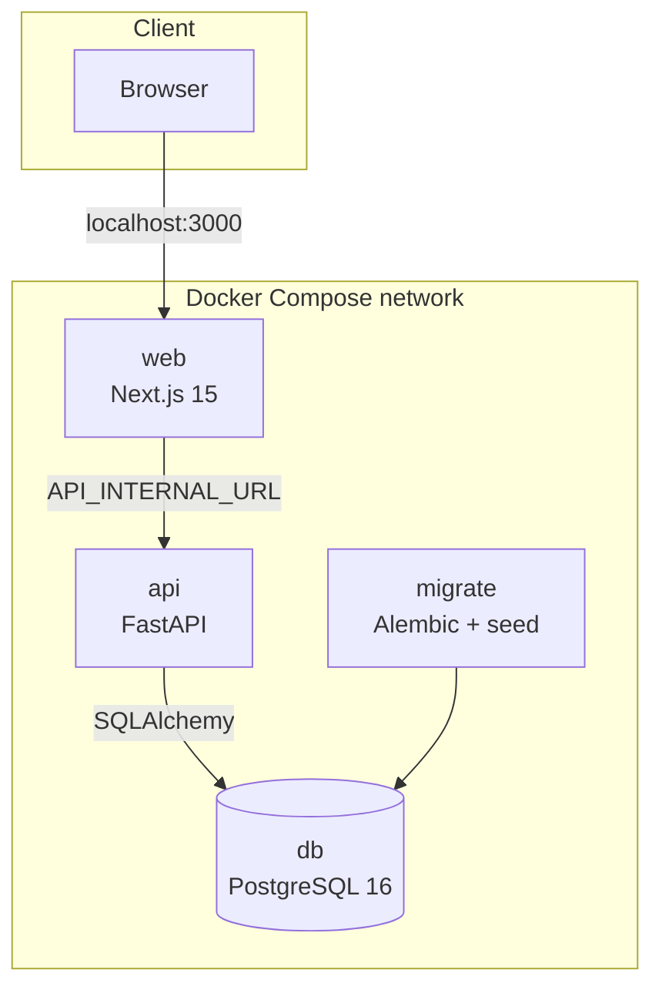

# Architecture

Chop It is a compact full-stack system designed to keep product rules explicit while remaining easy
to run and inspect. This document describes the public Lite edition included in this repository.

## Design goals

- Run the complete product locally with one Docker Compose command.
- Keep the web application and backend behind a documented API boundary.
- Put nutrition calculations in testable domain code rather than UI components.
- Use versioned database migrations and an idempotent fictional seed.
- Preserve useful ownership fields while exposing only one local demo profile.
- Avoid external services, secrets, and infrastructure that are not needed for the demonstration.

## Runtime components



### Web application

`apps/web` contains the Next.js App Router application. Pages are rendered on the server and
mutations use server actions. The API base URL is server-only, so browser code does not need direct
access to the backend container.

The four product routes are:

- `/chop-it/ingredients`
- `/chop-it/recipes`
- `/chop-it/plans`
- `/chop-it/shopping-lists`

### API service

`apps/api` exposes versioned routes under `/api/v1/chop-it`. Its module is split into:

| Layer | Responsibility |
| --- | --- |
| `api` | FastAPI routing, Pydantic request/response schemas, HTTP error mapping |
| `application` | Use-case coordination and transaction boundaries |
| `domain` | Pure nutrition types and calculations |
| `infrastructure` | SQLAlchemy models, queries, persistence, list generation data access |

The split is intentionally small. It gives calculations and workflows a clear home without turning
the demo into a framework.

### Database and migrations

PostgreSQL stores ingredient categories, ingredients, recipes and their components, plan entries,
shopping lists, and shopping-list items. Alembic owns the schema lifecycle. The application does not
rely on ORM auto-create behavior.

## Request lifecycle

For a typical mutation, such as adding a recipe:

1. A Next.js server action validates the form shape and calls the internal API client.
2. FastAPI validates the JSON contract with Pydantic.
3. The application service opens a transaction and delegates persistence to the repository.
4. Domain functions calculate nutrition from ingredient quantities, servings, and oil configuration.
5. SQLAlchemy persists the recipe and its ingredient relations.
6. The API serializes the calculated view and Next.js revalidates the affected route.

This keeps HTTP and rendering concerns separate from the calculation rules.

## Core product rules

### Nutrition

Ingredient nutrition is stored per 100 g/ml. For each macro:

```text
ingredient contribution = value per 100 × quantity / 100
recipe total            = sum of ingredient contributions + oil contribution
per-serving value       = recipe total / servings
```

Oil supports three explicit modes: none, grams, or sprays. Spray calculations use the configured
grams-per-spray value and validate the accepted spray range.

### Weekly plans

A plan item connects a date and meal slot to a recipe and serving count. Daily and weekly totals are
derived from current recipe nutrition rather than stored as disconnected manual values.

### Shopping-list generation

Generation starts from selected plan entries and then:

1. applies recipe or plan-item exclusions;
2. scales recipe ingredients to the requested servings;
3. groups identical ingredients;
4. subtracts pantry quantities;
5. records recipe-level source details;
6. classifies the remaining items by list section.

The generated list is a persisted snapshot, allowing completed shopping trips to remain reviewable.

## Startup sequence

Compose uses health and completion conditions instead of timing assumptions:

```text
db healthy → migrate succeeds → api healthy → web starts
```

The `migrate` container runs `alembic upgrade head` followed by the demo seed. The seed checks for
existing records before creating them, so ordinary restarts are safe. The `chop_it_data` named volume
preserves PostgreSQL data between runs.

## Configuration

`.env.example` documents every runtime value required by the stack. The defaults are deliberately
local and non-sensitive. `API_INTERNAL_URL` is used by the Next.js server inside Compose;
`DATABASE_URL` points the API and migration job to PostgreSQL.

No `NEXT_PUBLIC_*` configuration is required because the browser never receives infrastructure
credentials or internal service addresses.

Compose publishes the web and API services only on the host loopback interface. The application is
therefore reachable from the development machine but not advertised to other devices on the local
network.

## Quality strategy

- Domain tests verify nutrition calculations and validation boundaries.
- Repository and router tests cover persistence and API workflows.
- Jest and Testing Library verify the four user-facing pages.
- Ruff, ESLint, mypy, and TypeScript enforce style and type correctness.
- The production web build and Compose model are checked in CI.
- Multi-stage Dockerfiles run the final services as non-root users.

## Lite-edition boundary

This repository uses one fixed demo identity. Authentication, account management, user switching,
and cross-application orchestration belong to the original LifeHub environment and are intentionally
absent here. Before hosting this project for real users, follow the controls listed in
[`SECURITY.md`](../SECURITY.md).
