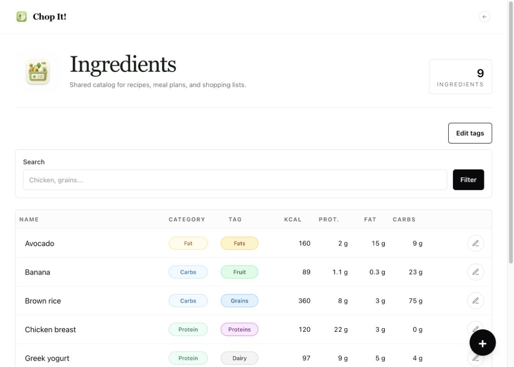
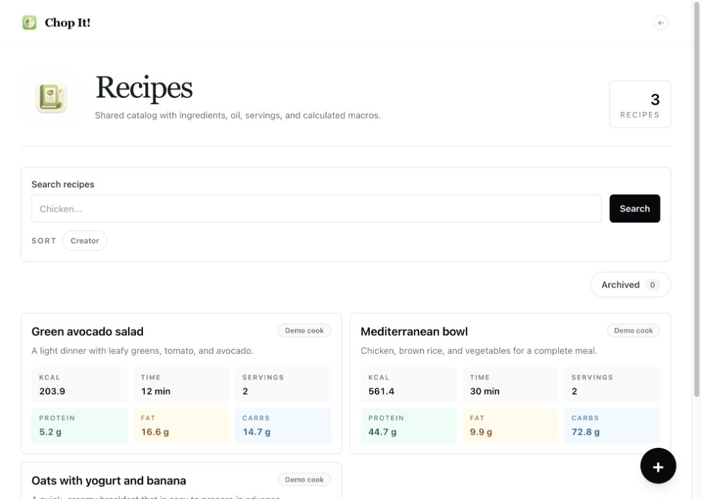
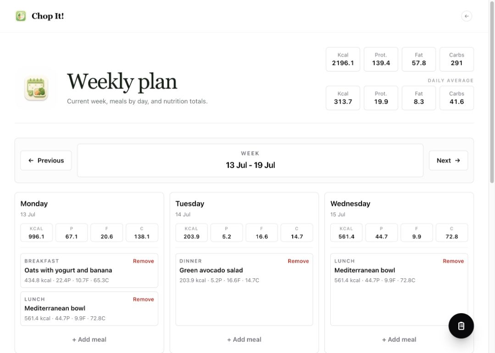
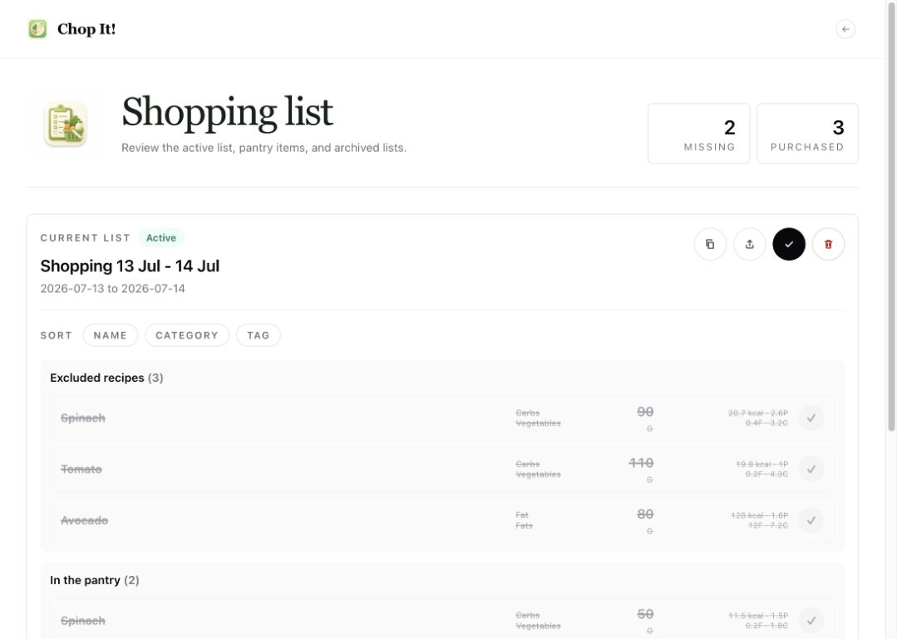

# Product tour

Chop It connects four everyday tasks into one continuous workflow: define the food catalog, build
recipes, plan meals, and buy only what the plan requires. This guide uses the fictional data loaded
automatically by the demo seed.

## The workflow at a glance


## 1. Ingredients



The ingredient catalog is the source of truth for nutrition calculations.

From this screen you can:

- search and sort the catalog;
- add or edit an ingredient;
- store energy, protein, fat, and carbs per 100 g/ml;
- choose a primary macro classification;
- manage secondary tags such as `Vegetables`, `Grains`, or `Dairy`;
- configure grams per spray for ingredients used as cooking oil.

Ingredients are archived instead of being silently removed when historical references matter.

## 2. Recipes



A recipe combines ingredient quantities with a serving count. Oil can be omitted, entered in grams,
or expressed as a limited number of sprays.

Chop It calculates:

- total energy and macros for the complete recipe;
- energy and macros per serving;
- preparation time and serving count;
- a warning when oil may have been entered twice.

Recipes can be searched, edited, archived, restored, or permanently deleted from the archive.

## 3. Weekly plan



The weekly view organizes recipes into breakfast, morning snack, lunch, afternoon snack, and dinner.
It derives nutrition totals from the selected recipe and number of servings.

Use the week navigation to inspect past or future plans. Each day shows its own totals, while the
header summarizes the week and its daily average.

The shopping-list action starts a guided flow where you can:

1. select one or more plan days;
2. exclude complete recipes or individual plan entries;
3. adjust the number of servings used for the calculation;
4. subtract quantities already available in the pantry;
5. generate a consolidated list.

## 4. Shopping list



Items from multiple recipes are grouped by ingredient and keep their recipe-level source breakdown.
The list separates:

- ingredients removed with an excluded recipe;
- quantities already covered by the pantry;
- ingredients still to buy;
- purchased ingredients.

You can sort the result, tick purchases, copy or export the list, complete it, and review archived
lists. Completing a list preserves the snapshot used for that shopping trip.

## Resetting the walkthrough

All seed operations are idempotent. To discard your local changes and return to the original demo
state, recreate the named database volume:

```bash
make reset-demo
```

Then open <http://localhost:3000/chop-it> and follow the four sections in order.
